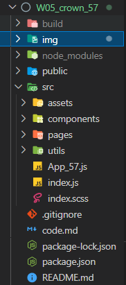
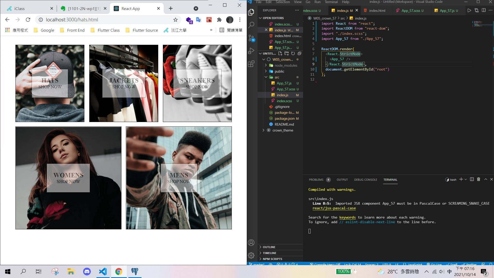
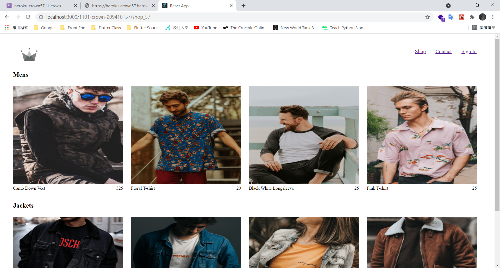
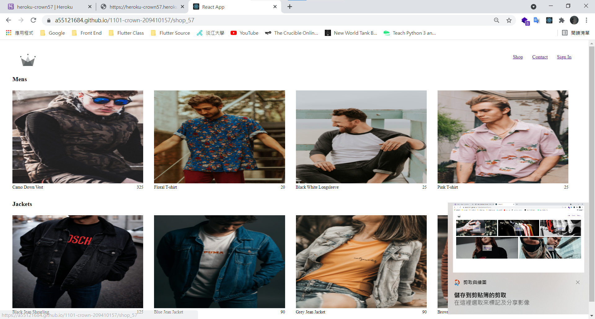
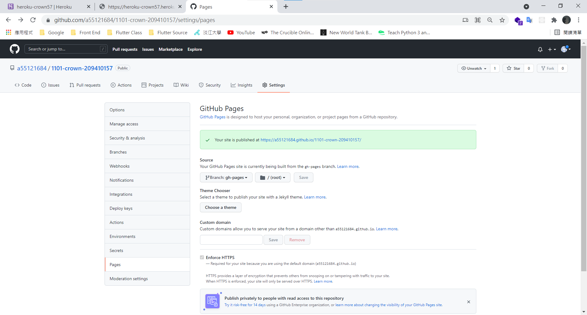

# 第一題




## => App_57.js

```
import "./App_57.scss";

function App() {
  return (
    <div className="App">
      <div className="homepage">
        <div className="directory-menu">
          <div className="menu-item">
            
            <a href="./hats.html" className="content">
              <h1 className="title">HATS</h1>
              <span className="subtitle">SHOP NOW</span>
            </a>
          </div>
          <div className="menu-item">
            
            <a href="./jackets.html" className="content">
              <h1 className="title">JACKETS</h1>
              <span className="subtitle">SHOP NOW</span>
            </a>
          </div>
          <div className="menu-item">
            
            <a href="./sneakers.html" className="content">
              <h1 className="title">SNEAKERS</h1>
              <span className="subtitle">SHOP NOW</span>
            </a>
          </div>
          <div className="large menu-item">
            
            <a href="./womens.html" className="content">
              <h1 className="title">WOMENS</h1>
              <span className="subtitle">SHOP NOW</span>
            </a>
          </div>
          <div className="large menu-item">
            
            <a href="./mens.html" className="content">
              <h1 className="title">MENS</h1>
              <span className="subtitle">SHOP NOW</span>
            </a>
          </div>
        </div>
      </div>
    </div>
  );
}

export default App;
```

# 第二題


## => Homepage_57.js

```
import React from "react";
import Directory_57 from "../components/Directory_57";
import "./Homepage_57.scss";

export default function Homepage_57() {
  return (
    <div className="homepage">
      <Directory_57 />
    </div>
  );
}
```

## => Directory_57_57.js

```
import React from "react";
import "./Directory_57.scss";
import MenuItem_57 from "./MenuItem_57";

export default function Directory_57() {
  return (
    <div>
      <div className="directory-menu">

        <MenuItem_57
          name={"HATS"}
          size={""}
          remoteUrl={"https://i.ibb.co/cvpntL1/hats.png"}
        />
        <MenuItem_57
          name={"JACKETS"}
          size={""}
          remoteUrl={"https://i.ibb.co/px2tCc3/jackets.png"}
        />
        <MenuItem_57
          name={"SNEAKERS"}
          size={""}
          remoteUrl={"https://i.ibb.co/0jqHpnp/sneakers.png"}
        />
        <MenuItem_57
          name={"WOMENS"}
          size={"large"}
          remoteUrl={"https://i.ibb.co/GCCdy8t/womens.png"}
        />
        <MenuItem_57
          name={"MENS"}
          size={"large"}
          remoteUrl={"https://i.ibb.co/R70vBrQ/men.png"}
        />
      </div>
    </div>
  );
}
```

## => MenuItem_57.js

```
import React from "react";
import "./MenuItem_57.scss";

export default function MenuItem_57({ name, remoteUrl, size }) {
  return (
    <div className={`${size} menu-item`}>
      
      <a href="./hats.html" className="content">
        <h1 className="title">{name}</h1>
        <span className="subtitle">SHOP NOW</span>
      </a>
    </div>
  );
}
```

# 第三題


## => MenuItemData.js

```
const items = [
  {
    id: 1,
    name: "HATS",
    remoteUrl: "https://i.ibb.co/cvpntL1/hats.png",
    size: "",
  },
  {
    id: 2,
    name: "JACKETS",
    remoteUrl: "https://i.ibb.co/px2tCc3/jackets.png",
    size: "",
  },
  {
    id: 3,
    name: "SNEAKERS",
    remoteUrl: "https://i.ibb.co/0jqHpnp/sneakers.png",
    size: "",
  },
  {
    id: 4,
    name: "WOMENS",
    remoteUrl: "https://i.ibb.co/GCCdy8t/womens.png",
    size: "large",
  },
  {
    id: 5,
    name: "MENS",
    remoteUrl: "https://i.ibb.co/R70vBrQ/men.png",
    size: "large",
  },
];

export default items;
```

## => Directory_57_57.js

```
import React, { useState } from "react";
import "./Directory_57.scss";
import MenuItem_57 from "./MenuItem_57";
import items from "../utils/MenuItemData";

export default function Directory_57() {
  const [menuItems, setMenuItems] = useState(items);
  return (
    <div>
      <div className="directory-menu">
        {menuItems.map((item) => {
          const { id, name, remoteUrl, size } = item;
          return (
            <MenuItem_57
              id={id}
              name={name}
              remoteUrl={remoteUrl}
              size={size}
            />
          );
        })}
      </div>
    </div>
  );
}
```

# 第四題

[Github](https://github.com/a55121684/1101-crown-209410157)

## local



## Ghpage



# 第五題

[Github](https://github.com/a55121684/1101-crown-209410157)

## Ghpage


[GithubPage](https://a55121684.github.io/1101-crown-209410157/)


# 第六題

## =>App.js


```
import Homepage_57 from "./pages/Homepage_57";
import ShopTwoPage_57 from "./pages/ShopTwoPage_57";
import { Switch, Route } from "react-router";

import SignInPage from "./pages/SignInPage_57";
import ContactPage from "./pages/ContactPage_57";
import Header_57 from "./components/Header_57";

function App() {
  return (
    <div>
      <Header_57 />

      <Switch>
        <Route path="/" exact>
          <Homepage_57 />
        </Route>
        <Route path="/shop_57" exact>
          <ShopTwoPage_57 />
        </Route>
        <Route path="/contact_57" exact>
          <ContactPage />
        </Route>
        <Route path="/signin_57" exact>
          <SignInPage />
        </Route>
      </Switch>
    </div>
  );
}

export default App;
```

# 第七題

# 第八題

# 第九題
